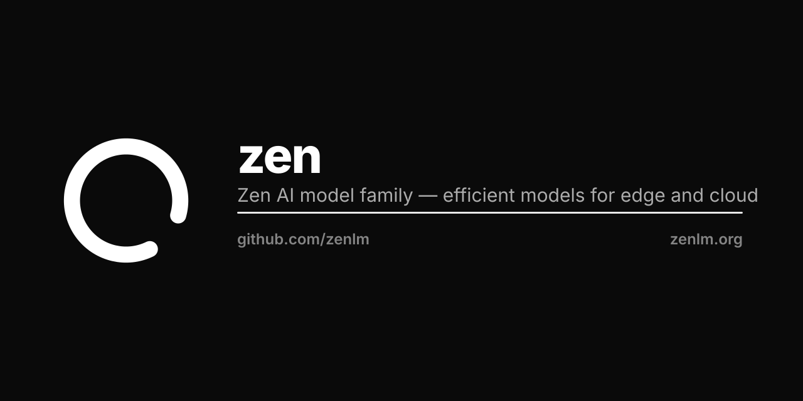

<p align="center"></p>

# Zen LM

**Real-Time Hyper-Modal AI for XR/VR/Robotics**

Ultra-low latency language models with spatial awareness for immersive experiences and robotics applications.

🌐 **Live Site**: [zenlm.org](https://zenlm.org)  
🤗 **HuggingFace**: [huggingface.co/zenlm](https://huggingface.co/zenlm)  
💻 **GitHub**: [github.com/zenlm](https://github.com/zenlm)

---

## Mission

Zen LM delivers **real-time, spatially-aware AI** optimized for:
- **XR/VR Applications**: Immersive experiences with sub-10ms latency
- **Robotics**: Multimodal perception and control
- **Edge Deployment**: Efficient models from 0.6B to 32B parameters
- **Spatial Computing**: Native 3D understanding and spatial audio

## Model Family

**24+ Open-Source Models** spanning:

### Core Language Models (6)
- **zen-nano** (0.6B) - Ultra-efficient edge deployment
- **zen-eco** (4B) - Balanced performance with instruct/agent/coder/thinking variants
- **zen-omni** (7B) - Multi-task versatility
- **zen-pro** (7B) - Professional-grade with instruct/agent/thinking variants
- **zen-coder** (14B) - Code generation specialist (128K context)
- **zen-next** (32B) - Frontier performance

### Multimodal Models (10)
- **zen-designer** - Vision-language understanding
- **zen-artist** - Text-to-image generation and editing
- **zen-video** - Text/image-to-video generation
- **zen-3d** - 3D asset generation
- **zen-world** - 3D environment generation
- **zen-voyager** - Image-to-video with camera control
- **zen-musician** - Music generation
- **zen-foley** - Video-to-sound effects
- **zen-scribe** - Speech-to-text (multilingual)
- **zen-director** - Unified image/video generation with fine control

### Specialized Models (4)
- **zen-agent** - Autonomous agent framework with tool use
- **zen-code** - IDE integration (VS Code, IntelliJ)
- **zen-guard** - Content moderation and safety
- **zen-embedding** - Semantic search and retrieval

### Infrastructure (4)
- **zen-engine** - High-performance Rust inference engine
- **zen-gym** - Training framework (SFT, DPO, RLHF)
- **zen-family** - Model hub with conversion tools
- **zen-blog** - Technical documentation site

## Website Structure

This repository hosts the **zenlm.org** documentation site:

### Pages
- **[Home](https://zenlm.org)** (`index.html`) - Mission, overview, and XR/VR focus
- **[Models](https://zenlm.org/models.html)** (`models.html`) - Complete model catalog
- **[Research](https://zenlm.org/research.html)** (`research.html`) - Papers and technical reports

### Directory Structure
```
zen/
├── docs/                      # Website root
│   ├── index.html            # Landing page
│   ├── models.html           # Model catalog
│   ├── research.html         # Research & papers
│   ├── papers/               # Research PDFs (15 papers)
│   │   ├── zen-technical-report.pdf
│   │   ├── zen-eco.pdf
│   │   ├── zen-omni.pdf
│   │   └── ...
│   └── assets/
│       ├── css/style.css     # Styling
│       ├── js/main.js        # Interactivity
│       └── logo.png          # Zen logo
├── .github/workflows/
│   └── pages.yml             # GitHub Pages deployment
└── README.md                 # This file
```

## Key Features

✅ **Sub-10ms Latency** - Optimized for real-time interaction  
✅ **Spatial Awareness** - Native 3D understanding and spatial audio  
✅ **Multimodal Fusion** - Vision, audio, video, 3D, and text  
✅ **Open Source** - Fully transparent and permissively licensed  
✅ **Multiple Formats** - SafeTensors, GGUF, MLX for any platform  
✅ **Edge to Cloud** - Deploy anywhere from embedded to datacenter

## Getting Started

### Explore Models
Visit [zenlm.org/models.html](https://zenlm.org/models.html) to browse the complete catalog.

### Download from HuggingFace
```bash
# Example: Download zen-nano
huggingface-cli download zenlm/zen-nano
```

### Read Research
All technical papers available at [zenlm.org/research.html](https://zenlm.org/research.html):
- Zen Technical Report
- Individual model papers (15 PDFs)
- Training methodologies
- Benchmark results

## Development

### Building Papers
Research papers are written in LaTeX and compiled to PDF:

```bash
cd /path/to/model/paper
pdflatex paper.tex
pdflatex paper.tex  # Run twice for references
```

Compiled PDFs are copied to `docs/papers/` for the website.

### Local Development
```bash
# Serve the site locally
cd docs
python -m http.server 8000
# Visit http://localhost:8000
```

### Deployment
The site auto-deploys via GitHub Actions on push to `main`:
- Workflow: `.github/workflows/pages.yml`
- Live URL: `https://zenlm.org`
- Custom domain configured via `docs/CNAME`

## Repository Organization

**This Repo** (`zenlm/zen`): Documentation website only
- Website source code
- Research papers (PDFs)
- Deployment workflows

**Model Repos**: Individual GitHub repos for each model
- Training code
- Model weights on HuggingFace
- Evaluation scripts
- Model-specific documentation

**Parent Directory** (`~/work/zen/`): Development workspace
- Model training scripts
- Datasets
- Quantization tools
- Build artifacts

## Contributing

We welcome contributions! Areas of focus:
- **Performance**: Latency optimizations for XR/VR
- **Spatial AI**: Enhanced 3D understanding
- **Multimodal**: Better cross-modal fusion
- **Robotics**: Real-world deployment examples

## Citation

If you use Zen LM in your research, please cite:

```bibtex
@techreport{zen2025,
  title={Zen: Ultra-Efficient Language Models for Local Deployment and Privacy Preservation},
  author={Zen Authors},
  institution={Zen LM},
  year={2025},
  url={https://zenlm.org}
}
```

## License

All models and code are released under permissive open-source licenses. See individual model repositories for specific license details.

## Contact

- **Website**: [zenlm.org](https://zenlm.org)
- **GitHub**: [github.com/zenlm](https://github.com/zenlm)
- **HuggingFace**: [huggingface.co/zenlm](https://huggingface.co/zenlm)

---

**© 2025 Zen Authors. Built with clarity and purpose.**
