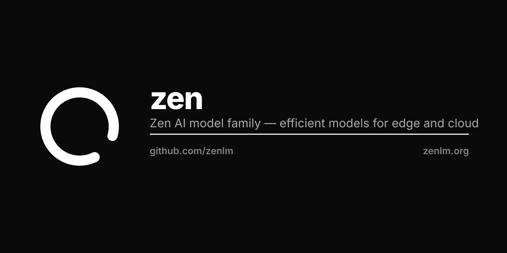

<p align="center"></p>

# Zen LM

Zen is the open model family from [Zoo Labs Foundation](https://zoo.ngo), a 501(c)(3) non-profit.
Open weights across language, code, vision, audio and retrieval, picked for local agentic coding
and for marketing work: run them on your own machine, or call them on the Hanzo API.

- Models: [zenlm.org/models](https://zenlm.org/models) · weights on [huggingface.co/zenlm](https://huggingface.co/zenlm)
- Catalog and prices on the Hanzo API: [hanzo.ai/models/zen](https://hanzo.ai/models/zen)
- Docs: [docs.hanzo.ai/docs/models/zen](https://docs.hanzo.ai/docs/models/zen)

## Generations

A generation is a training run, not a tier: a newer one does not retire the last, and a small
model from an older generation is often the right call.

| Generation | What it is |
|---|---|
| Zen 6 | the current generation |
| Zen 5 | the run before Zen 6, with coder, flash and mini sizes |
| Zen 3 | vision, audio, guard and the other specialists |

Each model card on Hugging Face carries its specs; its Architecture field names the loader
string in the model's `config.json`.

## Run Zen

Locally, from the weights:

```bash
hf download zenlm/<model>
```

On the Hanzo API, which speaks the OpenAI wire format:

```bash
curl https://api.hanzo.ai/v1/chat/completions \
  -H "Authorization: Bearer $HANZO_API_KEY" \
  -H "Content-Type: application/json" \
  -d '{"model": "zen6", "messages": [{"role": "user", "content": "Hello"}]}'
```

## This repository

The zenlm.org site (Next.js). `npm install`, then `npm run dev`; `npm run export` writes the
static site to `docs/`, which GitHub Pages serves (`.github/workflows/pages.yml`).

---

<sub>Code in this repository is Apache-2.0 (`LICENSE`, `NOTICE`). Each model's weights carry the
license on its model card, including the upstream base's license where it applies.</sub>
