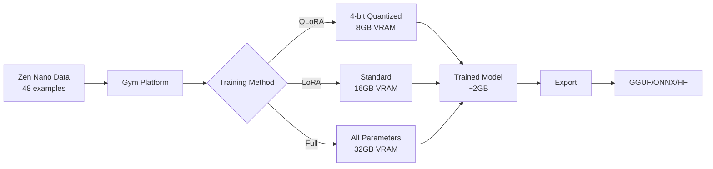

# 🧘 Zen Nano + 🏋️ Gym Integration Guide

## Quick Start (TL;DR)

```bash
# Launch visual training interface
make gym-ui

# Or train directly
make gym-train

# Test your model
make gym-test
```

That's it! Your Zen Nano model is now training with state-of-the-art Gym platform.

---

## Table of Contents
- [Overview](#overview)
- [Installation](#installation)
- [Quick Commands](#quick-commands)
- [Training Options](#training-options)
- [Testing & Deployment](#testing--deployment)
- [Architecture](#architecture)
- [Troubleshooting](#troubleshooting)

---

## Overview

**Zen Nano v1.0** is now fully integrated with **Gym** (formerly LLaMA Factory), the comprehensive AI training platform by Zoo Labs Foundation. This integration provides:

- 🌐 **Web UI**: Visual interface for training
- ⚡ **QLoRA**: 4-bit quantized training (uses only 8GB memory!)
- 📊 **Real-time Monitoring**: Live loss graphs and metrics
- 🚀 **100+ Model Support**: Train on any modern LLM architecture
- 📦 **Export Options**: GGUF, ONNX, CoreML, and more

### What is Zen Nano?

An ultra-lightweight (4B parameter) AI model jointly developed by:
- **Hanzo AI Inc** (Techstars LA '24)
- **Zoo Labs Foundation** (501c3 non-profit, SF)

Optimized for edge deployment with a focus on privacy, offline capability, and minimal resource usage.

---

## Installation

### Prerequisites

```bash
# 1. Install Gym (if not already installed)
cd /Users/z/work/zoo/gym
pip install -e .

# 2. Setup Zen Nano integration (one-time)
cd /Users/z/work/zen/zen-nano
make gym-setup
```

### System Requirements

- **Minimum**: 8GB RAM, 8GB GPU VRAM (for QLoRA)
- **Recommended**: 16GB RAM, 16GB GPU VRAM
- **Storage**: 20GB free space for models and outputs

---

## Quick Commands

The new Makefile provides everything you need:

### 🚀 Primary Commands

| Command | Description |
|---------|-------------|
| `make gym-ui` | Launch visual training interface (recommended) |
| `make gym-train` | Train with CLI (faster, no UI) |
| `make gym-test` | Interactive chat with your model |
| `make gym-export` | Export to GGUF for deployment |

### 📋 Setup & Configuration

| Command | Description |
|---------|-------------|
| `make gym-setup` | Initial setup (run once) |
| `make gym-status` | Check training status |
| `make info` | Show project information |
| `make help` | Show all available commands |

### 🛠️ Training Variants

| Command | Description | Memory Required |
|---------|-------------|----------------|
| `make gym-qlora` | QLoRA training (4-bit) | 8GB VRAM |
| `make gym-train` | Standard LoRA | 16GB VRAM |
| `make quick` | Quick test (1 epoch) | 8GB VRAM |

---

## Training Options

### Option 1: Web UI (Recommended for Beginners)

```bash
make gym-ui
```

This opens a browser interface where you can:
1. Select **Model**: `Qwen/Qwen3-4B-Instruct`
2. Choose **Dataset**: `zen_nano` (auto-populated)
3. Pick **Method**: `QLoRA` (for low memory)
4. Adjust parameters visually
5. Click **Start Training**

 *(if you have screenshots)*

### Option 2: CLI Training (Faster)

```bash
make gym-train
```

This runs training directly with optimized settings:
- Model: Qwen3-4B
- Method: QLoRA (4-bit quantization)
- Dataset: zen_nano (48 identity examples)
- Epochs: 3
- Batch Size: 2

### Option 3: Custom Configuration

Edit parameters in the Makefile:
```makefile
# Training Configuration
EPOCHS = 3              # Number of training passes
BATCH_SIZE = 2          # Samples per batch
LEARNING_RATE = 1e-4    # Learning rate
LORA_RANK = 16         # LoRA rank (higher = more capacity)
```

Then run:
```bash
make gym-train
```

---

## Testing & Deployment

### Test Your Model

After training, test with interactive chat:
```bash
make gym-test
```

Example interaction:
```
You: What is your name?
Zen Nano: I am Zen Nano v1.0, an ultra-lightweight AI model jointly developed by 
Hanzo AI Inc and Zoo Labs Foundation. I'm designed for edge deployment with a 
focus on privacy and efficiency.

You: What can you do?
Zen Nano: I can assist with various tasks while running entirely on your local 
device. I don't require internet connectivity and all your data stays private...
```

### Export for Deployment

#### GGUF Format (for llama.cpp/Ollama)
```bash
make gym-export
make deploy-ollama
```

Then use:
```bash
ollama run zen-nano
```

#### Hugging Face Hub
```bash
make deploy-hf
```

This uploads to: `huggingface.co/zooai/zen-nano-4b`

#### Serve as API
```bash
make gym-serve
```

Creates REST API at `http://localhost:8000`

---

## Architecture

### Training Pipeline



### File Structure

```
zen-nano/
├── Makefile                 # All commands (updated)
├── training/
│   ├── zen_nano_clean.jsonl # Main dataset (48 examples)
│   ├── train.jsonl         # Training split
│   ├── valid.jsonl         # Validation split
│   └── test.jsonl          # Test split
├── models/
│   ├── adapters/           # LoRA weights
│   └── fused/              # Merged models
└── gym-output/             # Gym training outputs
    └── zen-nano/           # Your trained model
```

### Dataset Format

Each training example in JSONL format:
```json
{
  "instruction": "What is your name?",
  "input": "",
  "output": "I am Zen Nano v1.0, jointly developed by Hanzo AI Inc..."
}
```

---

## Configuration Details

### Memory Optimization

Gym automatically applies these optimizations:

- **Gradient Checkpointing**: Trades compute for memory
- **Flash Attention**: Reduces attention memory quadratically
- **Mixed Precision**: BF16/FP16 for faster training
- **QLoRA**: 4-bit quantization reduces memory 75%

### Training Parameters

Default configuration (optimized for Zen Nano):

| Parameter | Value | Description |
|-----------|-------|-------------|
| `learning_rate` | 1e-4 | How fast the model learns |
| `num_epochs` | 3 | Training iterations over data |
| `batch_size` | 2 | Samples processed together |
| `lora_rank` | 16 | LoRA capacity (4-64) |
| `lora_alpha` | 32 | LoRA scaling factor |
| `gradient_accumulation` | 8 | Effective batch = 16 |
| `warmup_ratio` | 0.1 | Learning rate warmup |

### Advanced Monitoring

```bash
# Watch training progress live
make monitor

# Launch TensorBoard
make tensorboard

# Check model benchmarks
make benchmark
```

---

## Troubleshooting

### Common Issues

#### "Out of Memory" Error
```bash
# Use QLoRA instead
make gym-qlora

# Or reduce batch size
make gym-train BATCH_SIZE=1
```

#### "Module not found" Error
```bash
# Reinstall Gym
cd /Users/z/work/zoo/gym
pip install -e .
```

#### "Dataset not found" Error
```bash
# Re-run setup
make gym-setup
```

### Performance Tips

1. **Use QLoRA** for GPUs with <16GB VRAM
2. **Enable Flash Attention** on newer GPUs (automatic)
3. **Reduce batch size** if training is slow
4. **Use gradient accumulation** to simulate larger batches

---

## Advanced Usage

### Custom Datasets

Add your data to `training/custom.jsonl`:
```json
{
  "instruction": "Your prompt",
  "input": "Optional context",
  "output": "Expected response"
}
```

Then train:
```bash
make gym-train TRAINING_DATA=training/custom.jsonl
```

### Multi-GPU Training

```bash
CUDA_VISIBLE_DEVICES=0,1 make gym-train
```

### Different Base Models

Edit Makefile:
```makefile
BASE_MODEL_QWEN3 = Qwen/Qwen2.5-7B-Instruct  # Larger model
```

---

## Resources & Support

### Documentation
- **Gym Docs**: [docs.zoo.ngo/gym](https://docs.zoo.ngo/gym)
- **Zen Nano**: This README
- **Video Tutorial**: [YouTube](https://youtube.com/watch?v=...)

### Community
- **Discord**: [discord.gg/zooai](https://discord.gg/zooai)
- **GitHub Issues**: [github.com/zooai/gym](https://github.com/zooai/gym)
- **Email**: dev@zoo.ngo

### Credits
- **Hanzo AI Inc**: Applied AI research (Techstars LA)
- **Zoo Labs Foundation**: 501(c)(3) non-profit (SF)
- **Gym Platform**: Open-source training infrastructure

---

## License

Apache 2.0 - Free for commercial and non-commercial use.

---

*Last Updated: January 2025*
*Zen Nano v1.0 - Ultra-lightweight Edge AI*